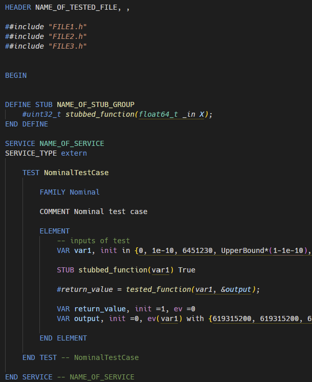

# rtrt-syntax README

This extension adds support for the `rtscript` language (by IBM RTRT). It offers syntax highlighting for `.ptu` files.

## Features

Adds syntax highlighting for most keywords, tags and variables used in `.ptu` files.

---

<!-- ## Requirements

If you have any requirements or dependencies, add a section describing those and how to install and configure them. -->

<!-- ## Extension Settings

Include if your extension adds any VS Code settings through the `contributes.configuration` extension point.

For example:

This extension contributes the following settings:

* `myExtension.enable`: enable/disable this extension
* `myExtension.thing`: set to `blah` to do something -->

<!-- ## Known Issues

Calling out known issues can help limit users opening duplicate issues against your extension. -->

## Release Notes

Soon...

---
